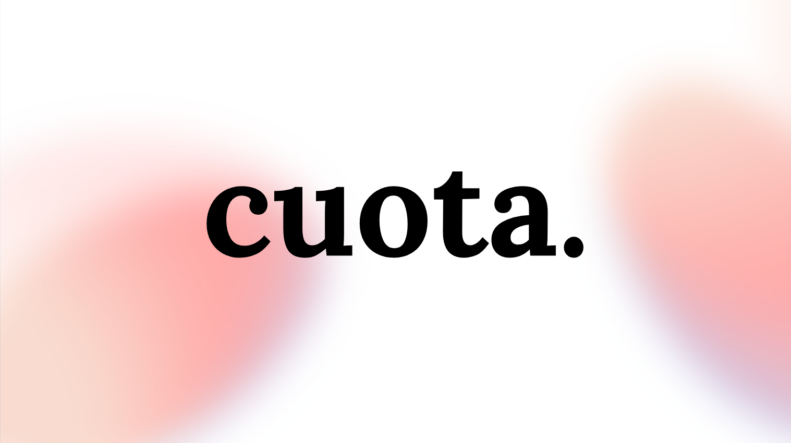

# Cuota File sharing

This is an app bootstrapped according to the [init.tips](https://init.tips) stack, also known as the T3-Stack.

# MinIo Setup

MinIo is a self hosted s3 storage solution.

## Apache Proxy configuration

This configuration allows public access to the self hosted Minio server (Running in Docker).

```
<VirtualHost *:443>
    ServerName storage.noekrebs.ch
    ServerAlias s3.noekrebs.ch
    ServerAdmin webmaster@localhost

    ErrorLog ${APACHE_LOG_DIR}/storage_error.log
    CustomLog ${APACHE_LOG_DIR}/storage_access.log combined

    ProxyRequests Off
    ProxyVia Block
    ProxyPreserveHost On

    <Proxy *>
         Require all granted
    </Proxy>

    ProxyPass / http://localhost:9000/
    ProxyPassReverse / http://localhost:9000/

    Header setifempty Access-Control-Allow-Origin "*"

    SSLCertificateFile /etc/letsencrypt/live/s3.noekrebs.ch-0001/fullchain.pem
    SSLCertificateKeyFile /etc/letsencrypt/live/s3.noekrebs.ch-0001/privkey.pem
    Include /etc/letsencrypt/options-ssl-apache.conf
</VirtualHost>
```

Currently there is a problem with CORS because the MinIo server dose not return a CORS Header for Images. This blocks the frontend from Automatically download the files. This is fixed with the following workaround in the Proxy configuration.

```
Header setifempty Access-Control-Allow-Origin "*"
```

# Ideas

- [ ] show if server is bottleneck
- [ ] Showcase. Option to create showcase where you can showcase your work. Includes option for custom branding in form of a image.
